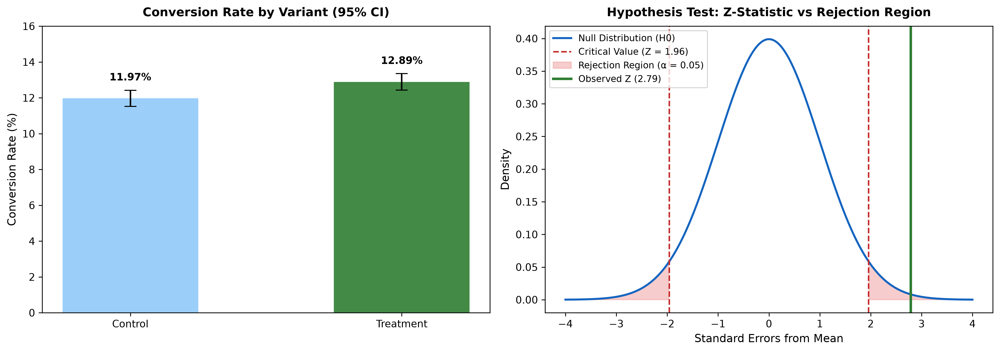
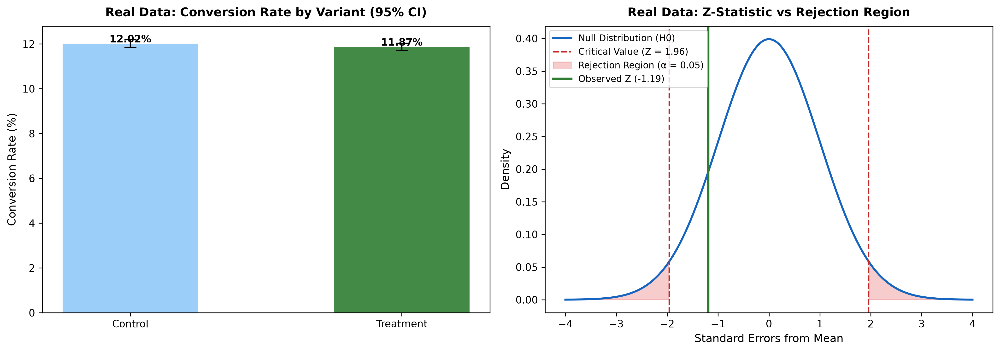

# A/B Testing Evaluation Framework: Synthetic Validation & Real-World Application
 
A complete hypothesis-testing pipeline — Sample Ratio Mismatch check, two-proportion
Z-test, confidence intervals, and a decision framework — built and validated against
a synthetic experiment with known ground truth, then applied to a real 290K-user
dataset to test whether a new landing page improved conversion.
 
Built with Python, SciPy, Pandas, and Matplotlib.
 
---
 
## Business Problem
 
Most portfolio A/B test projects stop at "p < 0.05, ship it." This project is
structured the way a real experimentation team actually evaluates a test: verify
the randomization wasn't broken (SRM check), test for statistical significance,
quantify the *range* of plausible effect sizes (confidence interval), translate
that into business impact, and — critically — report the result honestly even
when it doesn't support shipping the change.
 
---
 
## Approach: Two-Part Validation
 
**Part 1 — Synthetic data.** Before trusting the pipeline on real data, I built
a simulated 40,000-user experiment with a known, designed-in effect (true lift =
+1.1pp), and confirmed the pipeline correctly recovered an effect close to that
true value and correctly rejected the null hypothesis.
 
**Part 2 — Real data.** The same pipeline (unmodified) was then applied to the
[Kaggle A/B Testing dataset](https://www.kaggle.com/datasets/zhangluyuan/ab-testing)
(290K+ users, real landing page experiment), after cleaning two known data quality
issues in that dataset.
 
This two-part structure exists specifically to answer a question a good
interviewer will ask: *"how do you know your test is implemented correctly?"*
— by validating against a known ground truth first.
 
---
 
## Part 1: Synthetic Data Results
 
| Metric | Value |
|---|---|
| Sample size (per group) | 20,000 |
| Control conversion rate | 11.97% |
| Treatment conversion rate | 12.89% |
| Observed lift | +0.92pp |
| Z-statistic | 2.79 |
| P-value | 0.0053 |
| 95% CI (difference) | [+0.27pp, +1.57pp] |
| **Decision** | **Ship** |
 
The recovered lift (+0.92pp) closely matched the designed true effect (+1.1pp),
confirming the pipeline correctly detects a real effect when one exists.
 

 
### Decision Framework (Synthetic)
 
**Statistical significance: confirmed.** The 95% CI excludes zero entirely, and
the SRM check passed cleanly (χ² = 0.0000, p = 1.0000), confirming the random
split mechanism was uncompromised.
 
**Practical significance** was evaluated against an illustrative break-even
threshold of +0.50pp, scaled to a hypothetical 100,000 monthly active users:
 
| Scenario | Lift | Incremental Conversions/Month |
|---|---|---|
| Pessimistic (CI lower bound) | +0.27pp | +270 |
| Expected (point estimate) | +0.92pp | +920 |
| Optimistic (CI upper bound) | +1.57pp | +1,570 |
 
**Recommendation: Ship to production**, with phased rollout (50% → 75% → 100%
over 5–7 days), a Day 14/Day 30 novelty-effect audit to confirm the lift holds
over time, and a segment-level check (mobile vs. desktop, new vs. returning) before
fully deprecating the control design.
 
---
 
## Part 2: Real Data Results
 
| Metric | Value |
|---|---|
| Sample size (per group) | ~143,300 |
| Control conversion rate | 12.017% |
| Treatment conversion rate | 11.873% |
| Observed lift | **-0.145pp** |
| Z-statistic | -1.19 |
| P-value | 0.2323 |
| 95% CI (difference) | [-0.38pp, +0.09pp] |
| **Decision** | **Do not ship** |
 
The SRM check passed (χ² = 0.0377, p = 0.846), confirming valid randomization.
The 95% CI includes zero, and the point estimate is slightly negative — the new
page did not outperform the existing one, and may have performed marginally worse.
 

 
**Recommendation: Do not ship.** With 143,000+ users per group already collected,
this test is well-powered — a true effect of practically meaningful size would
very likely have appeared by now. Continuing to run the test longer is unlikely
to change the conclusion; the actionable move here is to retire this treatment
and test a different variant rather than extend the experiment.
 
---
 
## Synthetic vs. Real: Side-by-Side Comparison
 
| | Synthetic Data | Real Data |
|---|---|---|
| Sample size (per group) | 20,000 | ~143,300 |
| Observed lift | +0.92pp | -0.145pp |
| Z-statistic | 2.79 | -1.19 |
| P-value | 0.0053 | 0.2323 |
| 95% CI | [0.27pp, 1.57pp] | [-0.38pp, 0.09pp] |
| Decision | Ship | Do not ship |
 
The synthetic test validated the pipeline against a known effect. The real
dataset shows no statistically significant difference — a useful real-world
contrast, since not every experiment finds a winner, and a well-powered null
result is itself a valid, actionable finding: it prevents shipping a change
that offers no benefit (and here, plausibly a small regression) at real
engineering cost.
 
---
 
## Methodology
 
1. **SRM check**: chi-square goodness-of-fit test on group sizes (threshold
   p < 0.01, stricter than the main test since a false SRM flag discards an
   entire experiment)
2. **Descriptive conversion rates** by group, computed before any significance
   testing
3. **Pooled two-proportion Z-test**: uses the pooled conversion rate (assumes
   H0 — no difference — is true) to compute the standard error for the test
   statistic
4. **Unpooled 95% confidence interval**: uses each group's own observed
   conversion rate (not the pooled rate) to estimate the plausible range of the
   true difference — a different SE than the test statistic, and a common
   point of confusion worth knowing cold
5. **Data cleaning (real dataset only)**: dropped 3,894 users appearing in both
   control and treatment groups (a known logging issue in this dataset), and
   dropped rows where `group` and `landing_page` didn't match (e.g. a
   "control" user who was actually served the new page)
---
 
## Errors Encountered & Fixes
 
| Issue | Root Cause | Fix |
|---|---|---|
| Raw SQL-style multi-line query pasted directly into a Python cell threw `SyntaxError` | Carried over from the earlier cohort project — muscle memory of pasting query text without wrapping it as a string | Wrapped in triple-quoted string before passing to the query executor |
| Real dataset initially showed inflated group sizes with a nonzero p-value at first pass | 3,894 `user_id`s appeared in **both** control and treatment groups — a known issue in this specific Kaggle dataset caused by a logging bug at collection time | Identified and dropped all cross-contaminated `user_id`s before analysis, rather than analyzing the contaminated set |
| A second, less obvious contamination remained after the first cleaning step | Some rows had a `group` label that didn't match the `landing_page` actually served (e.g. `control` + `new_page`) — a separate data quality issue from the duplicate-user problem | Filtered out any row where `group` and `landing_page` were mismatched, in addition to the duplicate-user filter |
| Bar chart `plt.savefig()` guarded by `if not os.path.exists(...)` silently stopped saving updated charts on re-runs | The existence check meant that after the file was created once, subsequent edits to the chart wouldn't actually overwrite it — the "Saved" print statement still ran, creating a false sense that the file was current | Removed the existence check; always overwrite on save while actively iterating in a notebook |
 
---
 
## What I'd Improve With More Time
 
- Run a power analysis to determine the minimum sample size needed to detect
  a given effect size *before* collecting data, rather than only checking
  power retroactively
- Segment the real-data result by day-of-week or user cohort to check for
  effect heterogeneity that a single pooled test could mask
- Add a sequential testing / always-valid-p-value approach to avoid the
  peeking problem inherent in checking results before a test's planned end date
---
 
## Tech Stack
 
`Python` · `Pandas` · `NumPy` · `SciPy (stats)` · `Matplotlib` · `Jupyter Notebook`
 
---
 
## Data Sources
 
- Synthetic data: generated in-notebook (`np.random.binomial`, seed=42, fully reproducible)
- Real data: [Kaggle — A/B Testing Dataset](https://www.kaggle.com/datasets/zhangluyuan/ab-testing)
 
